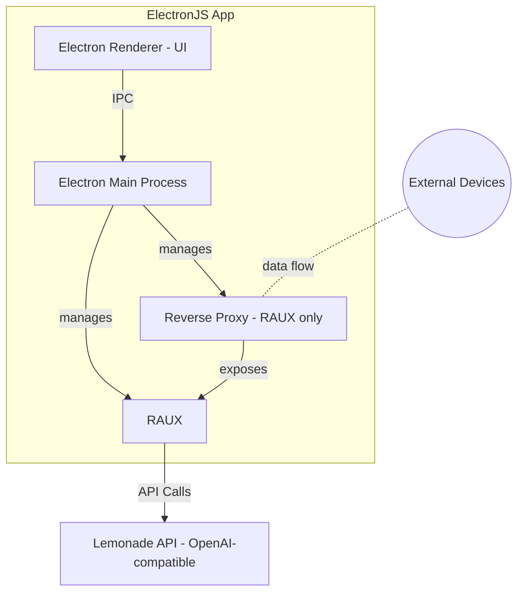
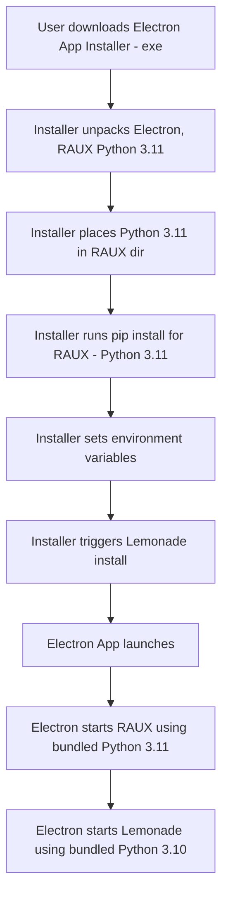

# ElectronJS Integration Plan for RAUX and Lemonade

## Overview
This plan outlines the high-level steps to integrate the RAUX app and the Lemonade API service into a unified ElectronJS desktop application. The goal is to enable seamless local and remote access, with a reverse proxy for device interoperability (specifically to allow RAUX to be accessed from other devices on the network).

---

## High-Level Integration Steps

1. **ElectronJS Shell**
   - Use ElectronJS to create a desktop application shell.
   - Electron will manage the lifecycle of both RAUX and Lemonade processes.

2. **Process Management**
   - On app start, Electron will:
     - Launch the Lemonade process (via batch file).
     - Launch RAUX.

3. **Reverse Proxy Setup (for RAUX only)**
   - Electron will start a local reverse proxy (e.g., using Node.js/Express or a lightweight proxy library).
   - The proxy will:
     - Expose RAUX to other devices on the network (e.g., mobile phones, tablets) by forwarding external requests to the local RAUX instance.

4. **App Integration**
   - RAUX will be loaded in the Electron window, either via a local URL or directly from the built static files.
   - All API calls from RAUX to Lemonade will be handled internally, without the reverse proxy.

5. **Inter-Process Communication (IPC)**
   - Use Electron's IPC mechanisms to:
     - Monitor and control the status of RAUX and Lemonade processes.
     - Relay logs, errors, or status updates to the Electron UI if needed.

6. **Packaging and Distribution**
   - Bundle RAUX, the Lemonade executable, and all dependencies with the Electron app for cross-platform distribution.
   - Ensure the installer sets up all required runtime environments.

---

## Architectural Diagram

---

## Logic Flow
1. User launches the Electron app.
2. Electron starts Lemonade and RAUX processes.
3. Electron sets up a reverse proxy to expose RAUX to the local network.
4. Electron window loads RAUX.
5. RAUX makes API calls directly to Lemonade.
6. IPC is used for process monitoring and control.

---

## Notes
- The reverse proxy is only for exposing RAUX to other devices on the network, not for Lemonade.
- All components should be bundled for seamless installation and updates.
- Security and network configuration should be considered for remote access scenarios.

---

## Installation

1. **Packaging and Release**
   - The ElectronJS app, RAUX, and Lemonade are bundled into a single Windows installer (`.exe`) using Electron Builder or a similar tool.
   - The installer is published as a GitHub Release for the Electron app. RAUX and Lemonade maintain their own separate releases, but the Electron release always includes specific, tested versions of both.
   - The installer contains:
     - The ElectronJS app (with reverse proxy logic)
     - RAUX source/distribution
     - Lemonade source/distribution
     - Standalone Python 3.11 (for RAUX) and Python 3.10 (for Lemonade), each in a portable format (not system-installed)

2. **Installation Flow**
   - User downloads and runs the Electron app installer (`.exe`) from GitHub Releases.
   - The installer:
     - Installs the ElectronJS app and unpacks RAUX, Lemonade, and their respective Python distributions into user-specified directories or defaults to `AppData/Local/RAUX` and `AppData/Local/Lemonade`.
     - Runs `pip install` for RAUX and Lemonade using their bundled Python interpreters.
     - Sets required environment variables for both apps (e.g., ports, API keys, paths).
     - Optionally creates desktop/start menu shortcuts.

3. **First Launch**
   - On first launch, Electron verifies the installations and environment.
   - Electron launches RAUX using the bundled Python 3.11 from the RAUX directory.
   - Electron launches Lemonade using the bundled Python 3.10 from the Lemonade directory.

---

### Installation Flow Diagram

---

**Notes:**
- No system-wide Python installation is required or modified.
- Each app uses its own isolated Python environment, avoiding version conflicts.
- All dependencies and environment variables are handled automatically by the installer.
- User can specify install locations, otherwise defaults to `AppData/Local/RAUX` and `AppData/Local/Lemonade`.
- No manual setup is required by the user.

---

## Updates

ElectronJS provides built-in mechanisms for seamless application updates. The Electron app can use the `autoUpdater` module or the community-supported `electron-updater` package to check for, download, and install updates from a remote server (such as GitHub Releases, S3, or a custom endpoint). When a new version is available, the app downloads the update in the background and prompts the user to restart, applying the update automatically.

Because RAUX is bundled within the Electron application, updating the Electron app also updates RAUX and any other packaged components. This ensures that both the desktop shell and the web app remain in sync and up to date. For more advanced scenarios, custom update logic can be implemented to update only specific components if needed.

All updates should be code-signed and distributed through a secure channel to ensure integrity and security.

---

## RAUX Electron Integration Implementation Plan

This section outlines the specific implementation steps for integrating RAUX into the Electron application. These steps focus on the RAUX component only, with Lemonade integration to be addressed in a future phase.

### Phase 1: Basic ElectronJS Setup & RAUX Integration

1. **Initialize Electron Project Structure**
   - [x] Set up basic Electron application with main and renderer processes using Electron Forge
   - [x] Configure package.json with required dependencies and scripts
   - [x] Create main entry points (main.js, preload.js)
   - [x] Set up proper Electron Forge configuration for packaging and distribution

2. **RAUX Process Management**
   - [x] Create a process manager module to handle RAUX startup/shutdown (implemented as `rauxProcessManager.ts` in TypeScript)
   - [x] Implement functions to read environment variables from config files (handled in process manager)
   - [x] Implement Python environment detection/validation (process manager always uses bundled Python, never system Python)
   - [x] Add logic to copy and configure .env file from .env.example template (done in process manager, only on first install)

   **Discussion:**
   - The install directory is user-configurable, but Electron always tracks and uses the bundled Python, never system Python. The backend and Python are always co-located under the install dir, and .env/.webui_secret_key are managed at first install only.
   - The process manager ensures requirements are installed only once, and Playwright logic is handled as in start.sh.
   - The process manager mimics start.sh logic: handles secret key, environment variables, requirements install, Playwright install, and always invokes uvicorn using the bundled Python.

3. **RAUX Startup Logic**
   - [x] Handle secret key generation/management (done in process manager)
   - [x] Configure PORT and HOST settings (done in process manager)
   - [x] Set up Playwright if needed (done in process manager)
   - [x] Use bundled Python 3.11 to execute the uvicorn instance (done in process manager)
   - [x] Ensure Node.js correctly passes environment variables to Python process (done in process manager)

   **Note:** Most of Step 3 is already covered by the process manager. Only Ollama integration remains for future work.

4. **Process Communication**
   - [x] Implement stdout/stderr capture from RAUX process
   - [x] Create logging mechanism for RAUX output
   - [x] Build status monitoring system

### Phase 2: UI Integration & IPC Features

5. **Electron Window Configuration**
   - [x] Create main application window pointing to RAUX URL
   - [ ] Implement loading states while RAUX is starting
   - [ ] Add error handling for connection failures

6. **IPC Implementation**
   - [ ] Create IPC channels for communication between main and renderer processes
   - [ ] Build control panel for RAUX process management
   - [ ] Implement restart/stop functionality

### Phase 3: User Experience & Packaging

7. **Application Lifecycle Management**
   - [ ] Implement proper startup sequence
   - [ ] Handle graceful shutdown of RAUX when Electron closes
   - [ ] Add auto-restart options for unexpected RAUX crashes

8. **Configuration UI**
   - [ ] Create settings panel for RAUX configuration
   - [ ] Make environment variables configurable through UI
   - [ ] Save/load configuration options

9. **Electron Packaging**
    - [ ] Configure Electron Forge for application packaging
    - [ ] Include all RAUX dependencies in the package
    - [ ] Set up Python bundling strategy for Windows

    **Backend Integration Strategy (Updated)**
    - [x] Explicitly list all backend files and folders needed for runtime in Electron Forge's extraResource array (e.g., open_webui, requirements.txt, .env.example, .webui_secret_key, start scripts, and any static data/db files)
    - [x] Use the old wheel build process as a reference for what to include, but do not build a wheel
    - [x] Maintain the extraResource config directly in forge.config.js in source control; do not patch or generate it in CI
    - [ ] Create first-run script to detect, download, and install portable Python 3.11
    - [ ] Implement pip install for requirements.txt using portable Python
    - [ ] Configure backend process launching from Electron using portable Python
    
    **Installer Strategy**
    - [ ] Use Electron Forge's NSIS target to create Windows installer
    - [ ] Configure desktop shortcuts and start menu entries
    - [ ] Create installer branding (icons, descriptions)
    - [ ] Create testing suite for verifying installation and startup
    - [ ] Configure one-click startup with all services properly initialized

10. **Auto-Update Implementation**
    - [ ] Set up update server connection
    - [ ] Implement update checking mechanism
    - [ ] Add update notification and installation process

---

### Final Phase: Reverse Proxy Setup (Network Features)

11. **Reverse Proxy Setup**
    - [ ] Implement lightweight proxy server using Node.js/Express
    - [ ] Configure network discovery to expose RAUX on local network
    - [ ] Add security measures for network access
    - [ ] Create local network URL display in UI

**Note:** The reverse proxy will be implemented after the core RAUX pipeline, UI, and IPC features are complete, to ensure a stable local experience before adding network exposure.

### Implementation Notes
- Focus on Windows platform first, following the installation flow in the existing plan
- Use Node.js child_process module to manage RAUX
- Use express.js for the reverse proxy implementation
- Bundle Python 3.11 with the application for RAUX
- Use the bundled Python 3.11 to execute the RAUX backend (uvicorn)
- Node.js will manage the Python process, not reimplement its functionality
- Store configuration in user data directory
- Use Electron Forge for modern build tooling, packaging, and distribution
- Create a single executable installer that handles all configuration automatically
- Implement automated tests for installation and startup to ensure reliability
- Handle .env configuration as part of the first-run setup

**Next Steps:**
- Integrate the process manager into Electron's main process lifecycle (start RAUX on app launch, stop on shutdown).
- Implement process communication: capture stdout/stderr, logging, and status monitoring for the RAUX process.
- Then proceed to UI integration and network features as outlined in Phase 2.
