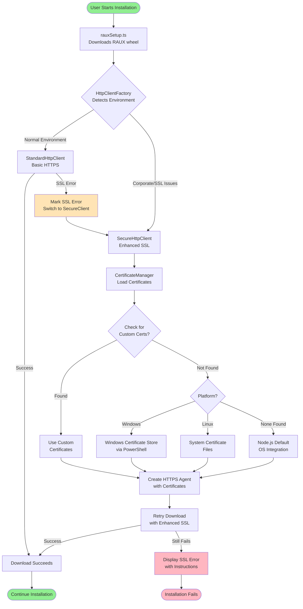

# SSL Certificate Handling Flow in GAIA UI

## High-Level Overview

This diagram shows how GAIA UI handles SSL certificates during installation when downloading components.

## Key Components

### 1. **rauxSetup.ts**
- Entry point for downloading RAUX components
- Uses HttpClientFactory to get appropriate HTTP client
- Handles download retry logic

### 2. **HttpClientFactory**
- Detects if SSL certificate handling is needed
- Checks for:
  - Previous SSL errors
  - Corporate environment indicators
  - Custom certificate configuration
- Returns appropriate client (Standard or Secure)

### 3. **StandardHttpClient**
- Default client for normal HTTPS connections
- Uses basic node-fetch without special SSL handling
- Detects SSL errors and triggers upgrade to SecureHttpClient

### 4. **SecureHttpClient**
- Enhanced client with SSL certificate support
- Creates custom HTTPS agent with certificate configuration
- Automatically retries failed connections

### 5. **CertificateManager**
- Loads certificates in priority order:
  1. Custom certificates (NODE_EXTRA_CA_CERTS)
  2. GAIA UI certificate directory
  3. OS certificate store
- Returns empty array if none found (lets Node.js use defaults)

### 6. **WindowsCertificateStore** (Windows only)
- Extracts certificates from Windows Certificate Store
- Uses PowerShell to export certificates in PEM format
- Provides seamless integration with corporate environments

## User Experience

### Best Case (Most Common)
1. Installation starts normally
2. Downloads work without issues
3. User never sees certificate handling

### Corporate Environment
1. Initial download fails with SSL error
2. System automatically switches to enhanced mode
3. Retrieves certificates from OS
4. Download succeeds automatically
5. User sees normal installation progress

### Manual Configuration Needed (Rare)
1. Automatic detection fails
2. User sees clear error message with instructions
3. User sets NODE_EXTRA_CA_CERTS or adds certificate file
4. Restart installation
5. System uses provided certificates

## Benefits

- **Zero Configuration**: Works automatically in most environments
- **Smart Fallback**: Only uses enhanced handling when needed
- **Performance**: Standard path remains fast for normal users
- **Security**: Always validates certificates (no bypass by default)
- **User-Friendly**: Clear errors and instructions when manual action needed